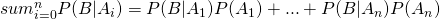

#  Intro to Bayes
Week 8 | 1.1

### LEARNING OBJECTIVES
*After this lesson, you will be able to:*
- Understanding the basics of Bayes Formula/Relation
- Introduction to the "ingredients" of the Bayesian "world view" (i.e. Posterior, Prior, Likelihood)
- Do some exercises (conceptual/mathematical) to build greater intuition/facility with Bayesian thinking

## Opening (5 mins)

 "*If [one] carries the umbrella and it does not rain, he is mildly inconvenienced. But if he does not carry the umbrella and it rains, he will suffer getting wet. A good Bayesian finds himself carrying an umbrella on many days when it does not rain. The policy actions of the last year were very much in this spirit. The Fed cut the interest rate to 1 percent to prevent the low probability outcome of spiraling deflation because it regarded that outcome as potentially very damaging while the alternative possible outcome of a rise of the inflation rate from 1.5 percent to 2.5 percent was deemed less damaging and more easily reversed.*"
 - Martin Feldstein, former chief economic advisor to Ronald Reagan

Why is this noted Harvard economist talking about rain and umbrellas?

Ready to learn Marty's lingo? All you have to do is memorize and understand a **special formula** (read on below), and all the secrets of world will be revealed to you; and you don't have to even join a carpet cleaning cabal (for the Seinfeld fans out there).

## Introduction: Topic (10 mins)

#### 1.1 Introduction to the Bayes Formula (Part 1 - The Numerator of Bayes Formula):

Let's talk about what this means, and first, what the notation means:

`P(A|B)` is a conditional probability. In other words, what is the probability of A occurring _given_ that B has occurred? Like the XKCD comic above, what's the likelihood that I am by the ocean _given_ that I have picked up a seashell?

`P(B|A)` is a different conditional probablity, meaning what is the probability of B occurring _given_ that A has occurred. In other words, what is the probability that I have picked up a seashell _given_ that I am by the ocean?

**Check**: This can sometimes be unintuitive. Let's really talk it through.

`P(A)` is the probability that A occurs (I am by the ocean)

`P(B)` is the probability that B occurs (I have picked up a seashell).

In other words, Bayes deals with the idea of probability distributions. Unlike inferential statistics (like confidence intervals, etc.) we are now in a world where we are considering likelihoods and _priors_. Bayes theorem let's us address how likely a current hypothesis is "I am by the ocean (or not) because of picking up a seashell" by looking at three related pieces of the world:

- How likely is it that I am at the ocean (in general) `P(A)`
- How likely is it that I can pick up a seashell (in general) `P(B)`
- How likely is it that I can pick up a seashell _if_ I am by the ocean? `P(B|A)`

The special sauce here is that we're working on the idea of a _prior_. We have some past idea of the state of the world (it will not rain, I am not by the ocean, I do not have cancer). We use Bayes to update our _prior_ to a higher or lower likelihood based on the introduction of some new feature (the newscaster says it will rain, I pick up a seashell, I take a test to determine if I have cancer or not). In almost every case, we have a prior that is open to changing (otherwise, this falls apart!)

The key point here is that we 1) have a past theory about the world, 2) we introduce some new data, and 3) based on that data, we change our theory about the world. 

## Demo: Topic (15 mins)

### Very Brief Summary of Basic Probability Results:

Probability, like other subfields of mathematics is dense, and you've probably forgotten some of the basic rules, here's a list of a couple useful identities to memorize when thinking about events, likelihoods, and all the other fun stuff you're going to get into throughout this week and your future life as a data scientist:

|     Rule  | Notation  | Written Description
|:-:|---|---|
| Addition Rule  | Assume A, B are independent: |  The probability of A or B is the probability of A plus the probability of B  |
| Multiplication Rule   | Assume A, B are independent: |  The Probability of A  and B is just the probability of A multiplied by the probability of B |
| Conditional Probability | Assume A, B are independent:  | The conditional probability of A conditioned on B is just the probability of A if A and B are independent |
| Complimentary   |  | The probability of the complement of A is just 1 minus the probability of A |

Time for some light exercises!

#### 1.1.1 Exercise 1 - Review of computing the conditionals

Suppose we assume the prior probability distribution can be thought of like a simple bias coined toss, where the probability of it raining is .4. Similarly, assume that the 'likelihood' probability of it raining again can be thought of as a simple biased coin toss, where the probability of it not raining is .9 if Marty thinks it will rain, and the probability of it actually raining is .7 if Marty doesn't think it will rain.

- What is the probability of it actually raining if Marty thought it would rain?
- What is the probability of it not raining if Marty didn't think it would rain?

#### 1.1.2 Finger Exercise 2 - Computing numerically with the basic Bayes formula

Following the scenario above, what is the Probability of it actually raining, given the *total probability* of the prior? (**hint**: We are asking for P(A|B))

## Guided Practice: 1.2 Introduction to the Bayes Formula (Part 2 - The denominator of Bayes Formula)  (25 mins)

As you saw from exercise 1.1.2, taking the "total probability" of the prior involved taking account of both possibilities for the prior, "doesn't think it will rain", and "thinks it will rain", by taking the probability of it raining and dividing it up by the sum of every probability computed in the terminal ovals on the diagram.

Said slightly more formally, the total probability is equivalent to the denominator of the Bayes formula: 

Although this formula can seem daunting at first, we can easily explain it in another way to hammer home the intuition:

In the above picture, we see that each A hypothesis includes a piece of the center oval, which represents B. Although, in general there could be some intersection between the A's, we've assumed that they, like the rain/umbrella example above, are mutually exclusive events (Although I may relax this assumption later).

## Independent Practice: 1.3 The Likelihood Function, The Prior, and the Posterior Distribution (25 minutes)

We're almost done with explaining the basic machinery of Bayesian analysis. You have the intuition, and understand how it can be applied to sets of events or elements. What's left? We'll take Bayes formula from elements to the world of statistics proper

As we know, statistics deals with observations, distributions, samples, parameters etc., and these concepts easily fit inside the Bayesian box. 

### More intuition

By now, you should have a sneaking feeling on the difference between Bayesian and Frequentist statistics. The differences can be summarized pretty easily as follows:

1. **Frequentist**: Believes that the "true" distribution is fixed (and not known), and we can glean more more about the "true" distribution by engaging in sampling, testing for effects, and studying relevant parameters of the population.
2. **Bayesian**: Believes that data/information can inform more "insight" into the population, and as we receive more data/information, our view of the population can be confirmed, or denied, but our view of the population is variable.

The Bayes view (which was actually developed by Laplace), is not only more practical/sensible, but it's impact on modern science has been profound. Everything from simulations, computational biology, and machine learning, primarily utilizes the Bayes approach. It's essentially a heuristic, and it fits neatly into an algorithmic approach or environment.

## Concluding thoughts

Some parting thoughts: We won't spend the next eternity discussing the nuances of the likelihood principle, and its ramifications in statistics (probably hundreds of monographs have been written just on that topic, and related issues). In fact, this issue of "inverting" the conditional probability helped start a schism in the field of statistics that lasted over half a century, between the "Frequentist" and the "Bayesian" statistician.

But the likelihood function merits this much explanation at least: It indicates that we can not only have an unknown parameter, like the case of classical frequentist statistics, where our job is usually to 'find' or estimate the unknown population parameter through sampling, but that the parameter can actually be 'random' (in fact, a random variable), and its definition/properties can be revealed through data, or samples.

Our next steps will be to take these concepts and formalism, develop them further, and also apply them to computing, which is where the real power lies in the Bayesian approach.

### ADDITIONAL RESOURCES

- [Resource 1](http://ocw.mit.edu/courses/electrical-engineering-and-computer-science/6-041-probabilistic-systems-analysis-and-applied-probability-fall-2010/video-lectures/lecture-21-bayesian-statistical-inference-i/)
- [Resource 2](http://people.stern.nyu.edu/wgreene/MathStat/Notes-2-BayesianStatistics.pdf)
