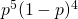
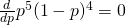
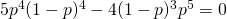
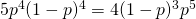
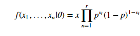
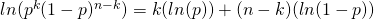
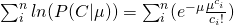
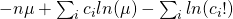
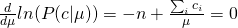
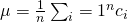

#  Bayes Deep Dive
Week 8 | 1.3

### LEARNING OBJECTIVES
*After this lesson, you will be able to:*
- Understand the MLE in the context of basic Bayesian analysis
- Conceptually explain the construction of some MLE of parameters for several distributions
- Review of the construction of the MLE with some basic Calculus

## Opening - 1.1 Finding the global maxima (5 mins)

Before we introduce the topic of *maxima* and *minima*, we'll mention some resources to review basic derivatives.

- [Khan Academy lectures/notes on basic differentiation](https://www.khanacademy.org/math/differential-calculus/taking-derivatives)
- In particular, [check out the video for taking derivatives of the form f(x) = x^2](https://www.khanacademy.org/math/differential-calculus/taking-derivatives/derivative-intro/v/calculus-derivatives-2-5-new-hd-version).

This will be the extent of Calculus you'll need to know to understand MLEs under the hood! But we also highly recommend that you check out [this simple page from Brown University's math department](http://www.math.brown.edu/UTRA/derivrules.html). This will go over the basic rules of **univariate differentiation**.

**Check**: Take a few minutes to review the materials, discuss in groups, and prepare any questions. Afterward, we'll move onto the calculations!

## Introduction: 1.2 Analytically finding the peak  (10 mins)

Calculating the *global maxima* (or minima) is a fairly simple procedure; however, it will require a little bit of the calculus that we referenced above.

Suppose we took a simple Bernoulli function: 



Let's say we wanted to find the *maximum value* of this function, what would that mean?

1. The function would have to "peak" at some point; therefore, in some way, the function would have to look somewhat like a inverted parabola.
2. This peak would have to be a 'global' peak, i.e. it can have multiple peaks, but only one can be the 'largest'
3. Once we find the peak, the value/level of the peak is not what we're actually interested in (the Y-value of the function). What we're actually interested in is what X we would need to input to get that Y.

For kicks, we'll also add the condition that the function has to be continuous and differentiable, henceforth referred to as **nice** functions.

```python
from matplotlib import pyplot as plt
import numpy as np

x = np.linspace(0,1,100)   # We want to ensure we have enough "granularity" in the graph so we set hasmarks to 100
y = x**5*(1-x)**4  # Mapping the Bernoulli scheme
plt.plot(x,y)

#Uncomment this after reading / working through 1.2
#plt.axvline(x=.55556,color='k',ls='dashed')

plt.show()
```

We have a nice plot that satisfies the above requirements. We can eyeball the peak of this upside down parabola, but that's not really "scientific." 

In the context of the plot we just made, how can we characterize the peak? The easiest way is to note that it's a point of 'inflection' on the graph that is before the peak, the slope of the graph is positive and so after the peak, the slope of the graph is negative. This is great, because whenever we start talking about slopes for **nice** functions we can bring in our friend, *Calculus*.

In particular, if the slope of the graph is positive at one side of the graph, and negative on the other, it must at some point be 0. This is a condition (but not always sufficient) we need to have to find the peak.



This is a product, and hence, we utilize the product rule to analytically solve the derivative to get the following:



We now "balance" the equation by taking the conveniently negative part of the left-hand side to the right-hand side and get the following:



Do some algebra, and we get the following:

`p = .55556`

Did it work? Uncomment out the plt.axvline in the code above and see!

## Demo: The Problem with Generalizing - Topics and Finger Exercises (5 mins)

So you've learned a new trick. Great!

Now you can go forth and solve all global maxima problems right?

Well... we did it for a Bernoulli scheme, but in general, if we wanted to compute the likelihood function as part of a posterior, we would need take the joint Bernoulli distribution, which (assuming independent identically distributed), would look something like this:



That's a (sort of) bummer, because if we wanted to get the derivative of `p`, we would have to compute `r` terms applying the product rule for each `i-th` product sequentially.

Actually, this isn't really that hard, but because we're humans, and not computers, our squishy brains don't like to deal with a long string of slightly different symbols, we much rather deal with long strings of more or less similar symbols. So someone a long time ago (probably a Frenchmen), came up with a work-around.

### Enter the Log-Likelihood Procedure

It turns out that to deal with that, we take the log of the Bernoulli distribution above, and it should look like:



### Computing the MLE for parameters

Let's try and find the MLE for a Poisson distribution. Remember that in each of these distributions, we're going to have some sort of Counts of observations that happened in a given time, such as:

`C = c_1, c_2,...c_n`

**PROOF**: Start by defining our Poisson counts, remember, the Poisson distribution will be a finite sequence, representing observations given within a specified length of time. Therefore if we define the counts as `$C = c_1, c_2,...,c_n`, we have the following:



Where:
- `C` is that collection
- `mu` is the average number of success at that point
- `ci` is the i-th item in that collection

Then, we can make that series into the following form:



After this, we actually show how the "optimization" looks like by the following: 



Again, emphasizing that we want to take the derivative with respect to `mu` of the Poisson form we derived and set it equal to 0. This is basically just the definition of optimization. Finally, if we do that then we get the final results: 



### Plotting the prior, likelihood and posterior

So you may start to wonder, I get that MLE applies to the likelihood function, but hey! Isn’t Bayesian analysis more than just the likelihood function? Aren't we supposed to be taking into account prior data, if we were good Bayesians?

The answer to both questions are: yes!

For several reasons, MLE is not always the best procedure for Bayesian inference.

One obvious issue is overfitting numerically to just the functional form of the likelihood, and not taking into account any prior data. Of course, to take into account the prior, you will have to do a similar optimization scheme on the whole posterior, as opposed to individual components of the posterior (i.e. likelihood).

This second optimization is called appropriately enough: Maximum A-Posterior Estimation (MAP)

Need a review? Check out [the following resource](https://www.probabilitycourse.com/chapter9/9_1_2_MAP_estimation.php) and [video](https://www.youtube.com/watch?v=kkhdIriddSI) for MAP.

Now let's demonstrate when MLE = MAP visually!

Instructions: Do this individually. Use Numpy to visualize the Bernoulli scheme on an X-Y grid. Show how a prior distribution can affect the posterior (or the product of the two).

```python

# Solution

from matplotlib import pyplot as plt
import numpy as np

x = np.arange(0,1.,.01)   # We want to ensure we have enough "granularity" in the graph so we set hash marks to 100
y = (x**5)*(1-x)**4  # Mapping the Bernoulli scheme

# Alter the prior and see how that visually alters the posterior

prior = (x**.46)*(1-x)**.32
z = y*prior

#plt.plot(x,prior)
plt.plot(x, y, 'r',x, z, 'g--')
plt.axvline(x=.55556,color='k',ls='dashed')

plt.show()

```

## Review/Recap (5 mins)


***

### ADDITIONAL RESOURCES

- For those who want a challenge, and are curious/fascinated by this topic, [this is an EXCELLENT reading on the history (historical/analytic development) of the MLE](https://arxiv.org/pdf/0804.2996.pdf)

- A fairly ["calculus-light" slide deck summarizing MLE](http://spia.uga.edu/faculty_pages/monogan/teaching/ts/B2mle.pdf)

- This will provide alternative proofs / commentary on MLE for various distributions. It's probably also good for your background if you are [up for a really deep-dive challenge](https://onlinecourses.science.psu.edu/stat504/node/28)
