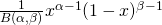
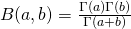

#  Case Study in Bayesian Analysis 1
Week 8 | 1.4

## Introduction

The presidential voting season has just ended, but let's apply some of the Bayesian lessons we've learned to some older election data.

## Exercise

This table provides the likelihood/prior conjugate prior combinations that ensure computational tractability for calculation of posterior distributions.

| Prior  | Likelihood  |
|---|---|
| Beta  | Binomial  |
| Dirichlet  | Multinomial   |
| Gamma  | Gaussian |
| Gaussian  | Gaussian |

#### Requirements
Some basic background:

We are finally going to use the much anticipated `Beta Function` today to do our first real computational Bayesian exercise! See the following:

Wait, what's `B`? We can define `B` as the following:

Let's try calculating this out in Python!

#### Additional Resources

For those of you who want to read further:

- [Here is a more detailed treatment on campaign/polling/votes and how Bayesian analysis is applied](http://www.stat.columbia.edu/~gelman/presentations/gelman_ieor.pdf)

- [This is an interesting analysis of the possible determinants of voter political preferences in the United States](http://www.stat.columbia.edu/~gelman/presentations/redbluetalkubc.pdf)
