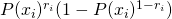
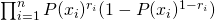
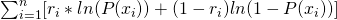

#  Logistic Regression with PyStan
Week 8 | 2.2

## Introduction

As you recall, for linear regressions, we estimate parameters by deploying some kind of least square technique, the usual suspect being the ordinary least squares (OLS). However, a logistic regression breaks one of the cardinal assumptions of OLS, namely the normality of the target (dependent) variable, since logistics are binary.

You'll recall that we have to deploy the apparatus of the MLE to do parameter estimation for the right-hand side of the equation. Recall that MLE seek to find the maximum probability given the data at hand.

MLE's require a few ingredients: one is a well defined likelihood function. Given the fact that we are dealing with binary targets, we can easily model these using Bernoulli scheme:

Recall also that we seek to maximize the following: 

Because of the annoying property of computing the derviatives numerically, it's best to trasform this with the logarithm, which makes this into computing a derivative of a product chain to computing a derivative of a sum:

This is much easier for the computer to optimize (no worries! We won't be expecting you to do this by hand at all!)
