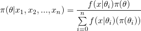
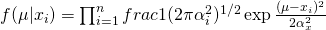
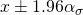
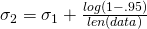

#   Assessing Confidence the Bayesian Way
Week 8 | 4.1

### LEARNING OBJECTIVES
*After this lesson, you will be able to:*

1. Understand the mathematics behind the credible interval
2. Apply your previous learnings on Bayesian statistics in a formal 'decision process' for statistical estimation
3. Understand the difference between credible intervals and confidence intervals

<a name = "opening"></a>
## A Review of Classical Confidence Intervals (5 min)

As you recall, statistical testing forms the foundations of many statistical "decision making processes". The point is to define some value: A difference of quantities, A quotient of quantities etc.. This quantity is usually a population parameter which can be nicely analyzed under an assumed distribution (usually normality).

Once we have a distribution, we can build the confidence band around the quantity that tells us ... tells us what? Well, this is where we need operate with care, cause the formal definition of the confidence band is as follows:

If we assume a certain confidence level `alpha`, then `alpha` % of the confidence intervals will "include" the quantity within the intervals lower and upper bounds.`


## Introducing Statistical Testing - Bayesian Way (10 mins)

Like previously, we will show the equivalent Bayesian formalism for the confidence interval. As you recall, in many cases, we can reconstruct the classical statistic (regression, model etc.) by constructing a non-informative posterior distribution. We usually like to show this equivalency because it better demonstrates that Bayesian statics can be thought of as a more general approach to statistical analysis. Whereby, we can include prior information to tune results more towards "reality" or the local data, but barring that extra information, we arrive at similar or equivalent results to the established classical literature.

To review, a posterior distribution look like the following:



### The Mathematical Predicates for the Credibility Intervals

A non-informative prior is one where the prior is selected to be "uniform" or otherwise not impact the formula in a way with "information" extracted from either the modelers opinions or from data itself. In this case, we define the non-informative prior to a uniformly valued function and we can assumed the likelihood function as the following:



So what are we doing here? We're assuming the likelihood is normally distributed, and since we are assuming non-informativity, this makes the numerator much simpler, and in fact as we have already proved, by setting our prior to this, we will get the identical results as the classical confidence interval.

## Blast from the past - Confidence Intervals (15 mins)

To better hammer in the point of the similarity, let's go ahead and review and construct a classical confidence interval. As you recall, we learn about the confidence interval when we need to discern whether an effect we have observed from an experiment is "statistically significant". From the above commentary on the convoluted nature of the interpretation of these results, we know that there is a bit of linguistic legerdemain required in "accurately" reporting results to the experimenter and/or any stakeholder.

Under these circumstances, the more "common sense" interpretation of Bayesian statistics may help you communicate your results more accurately and clearly in plain english, while still leveraging the data-visualization power of classical statistics (i.e histograms, etc.)

Anyway, to resume, recall that we want to leverage 'nice' properties about population parameters (mean, medians etc.) for creating our confidence interval, in this case, statisticians/researchers often also leverage the assumption of normality so they can make produce results about the variance as well.

So the confidence interval often looks something like this for the 95 percentile:



Again, the 95th percentile is 1.96 standard deviations from the estimated mean (or sample mean). This concept can further be encapsulated into a single under the guise of the p-value (Although, this practice has been increasingly being discouraged in recent times given the disturbing prevalence of 'p-hacking'). The p-value is in itself just a conditional probability that states: if we assume that we have the correct mean, distribution etc., what is the probability that we would observe the value we observed in the data/experiment.

As a review in-code, let's build a quick confidence interval so we can be sure of ourselves that we know how it works:

## Credible Intervals (25 mins)

Now that we are assured our understanding of the classical results, and how to implement them in python, let's move on towards developing an equivalent Bayesian perspective in Python.

As previously with our Bayesian analysis, we need to do some mathematics to get to the result. Our non-informative predicate prevents the prior-distribution from making our numerator more complex than it has to. Therefore, resolving the posterior distribution will  be more or less reduced to resolving the likelihood function. Yet, the likelihood function is itself a product of normally distributed variables... a monstrosity to disentangle mathematically.

However, if we recall, the best trick to solve this using MLE (or MAP). After a bunch of calculus and solving systems of equations, we get the following closed form as the solution:



Where, `sigma_1` is the minimum value of the sample.

So our job is to code that up into Python:

```python
# Take your random vector of data and compute the min - We are using the numpy methods for brevity/clarity

minimum = data.min()

# Compute the second sigma thus defining your upper bound
sigma_2 = minimum + np.log(.05)/len(minimum)
```

<a name = "conclusion"></a>
## Conclusion (5 min)

We've gotten our feet wet with the Bayesian credibility interval, the next step will be to apply this to data and work closer with some Python library methods to make the computation easier/streamlined.

## Additional Resources

- [Credibility Intervals](https://en.wikipedia.org/wiki/Credible_interval)

