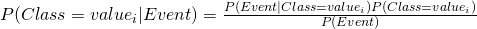
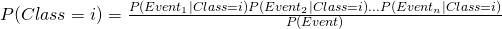
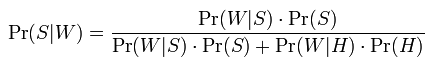

#   Naive Bayes  
Week 8 | 3.1

### LEARNING OBJECTIVES
*After this lesson, you will be able to:*
- Describe Naive Bayes
- Start to become familiar with the scikit-learn's implementation of Naive Bayes

## Coming full-circle, it all comes back to Bayes Rule (5 min)

By now, you should expect to see this formula (again and again, and again), and can safely assume it will play either the central (or highly influential) component of anything with the label "Bayesian" in it. Just in case you've forgotten the formula, here it is (yet again):



Notice that this version of the Bayes formula is on a set of events, which will make assessing/resolving/interpreting it much simpler. In fact, this classifier is often used (similar to a logistic regression and/or CART) to analyze a 2-class target (i.e a target that assumes only 0 or 1 say).

As usual, `P(Class = i)` is the probability that `value_i` has occurred, and the posterior can be interpreted as the probability of event `$i$` occurring after observing previous events. Further, the great thing about naive Bayes is that it only requires one simplifying assumption, and still performs well even if it's not fully satisfied!

## The basic formalism of Naive Bayes (10 mins)

We're going to extend the Bayesian formula/relation a little to the following:



for each `i` in the set of classes (again, if we had only two classes, i = 0 or i = 1), and where Event_1, ..., Event_n forms a partition of Event. We've seen this before, in the first lesson of the week. However, as you recall, for us to be able to make this substitution, we must assume that the probability of these events are independent.

To circle back and review, let's take an example, we can use canonical Spam classifier problem:



This is the ordinary posterior distribution. Note the denominator is just the total probability. We can interpret the various components as follows;

- `P(S|W)`: Probability that Message is spam given word W occurs in it.

- `P(W|S)`: Probability that word W occurs in a spam message.

- `P(W|H)`: Probability that word W occurs in a Ham message.

More can be read about [Span filtering here](https://en.wikipedia.org/wiki/Naive_Bayes_spam_filtering)

The cool thing about Naive Bayes however, is that in practice, we don't really need these assumptions strictly satisfied to get great performance out of the procedure (the miracle of Machine Learning!).

## Using the Naive Bayes Implementation in Scikit-learn (15 mins)

We've gone over the formalism of Bayesian analysis several times now, so we should be safe there. Let's get more hands-on work with analyzing Naive Bayes for computing.

```python
from sklearn.naive_bayes import GaussianNB
import numpy as np

# Import data into a numpy array
X = np.array([[-1, -1], [-2, -1], [-3, -2], [1, 1], [2, 1], [3, 2]])
Y = np.array([1, 1, 1, 2, 2, 2])

#Initialize a variable as the Guassian Naive Bayes classifier and fit it with the data
clf = GaussianNB()
clf.fit(X, Y)
GaussianNB()

# Predict a few instances
print(clf.predict([[-0.8, -1]]))
clf_pf = GaussianNB()
clf_pf.partial_fit(X, Y, np.unique(Y))
GaussianNB()
print(clf_pf.predict([[-0.8, -1]]))
```

## Write your own Naive-Bayes classifier for real data (25 mins)

We're going to now try our hand at classifying some SPAM, a perennial problem, and a canonical example for machine learning with naive Bayes. Let's first load up the data

```python
import sklearn.naive_bayes as nb
import numpy as np
import pandas as pd 

pd.read_csv('https://archive.ics.uci.edu/ml/machine-learning-databases/spambase/spambase.data')
```
<a name = "Indy"></a>
## Apply your Naive Bayes on the data  (25 min)

Now we should take the results above and try our hand with Naive Bayes. Which Naive Bayes classifier should we utilize? There are 3 variants (Normal, Bernoulli, Multinomial). Could we do some conversion of the data and try one or the other? How should we think about diagnosing the model performance?

Again, we must defer to the docs:

- [Docs 1](http://scikit-learn.org/stable/modules/generated/sklearn.naive_bayes.GaussianNB.html)
- [Docs 2](http://scikit-learn.org/stable/modules/generated/sklearn.naive_bayes.MultinomialNB.html)
- [Docs 3](http://scikit-learn.org/stable/modules/generated/sklearn.naive_bayes.BernoulliNB.html)

The differences can be summarized as follows
-    ***BernoulliNB*** is designed for binary/boolean features
-    The ***multinomial Naive Bayes classifier*** is suitable for classification with discrete features (e.g., word counts for text classification). The multinomial distribution normally requires integer feature counts. However, in practice, fractional counts such as `tf-idf` may also work
-    ***GaussianNB*** is designed for continuous features (that can be scaled between 0,1) and is assumed to be normally distributed

```python

feature_set = df.iloc[:, :-1]
target = df.iloc[:, -1]

classifier1 = MultinomialNB()
classifier1.fit(feature_set, target)
```

<a name = "conclusion"></a>
## Conclusion (5 min)

This lesson, we observed how to instrument the data to feed into the Naive Bayes classifier. We can proceed to applying this next!

#### Additional Resources

- [An interesting slide from a Stanford MOOC which had a section on Naive Bayes](https://web.stanford.edu/class/cs124/lec/naivebayes.pdf)
- [A much more technical paper comparing Naive Bayes to Logistics Regressions](https://www.cs.cmu.edu/~tom/mlbook/NBayesLogReg.pdf)
- [More exposition on Naive Bayes](http://blog.yhat.com/posts/naive-bayes-in-python.html)
